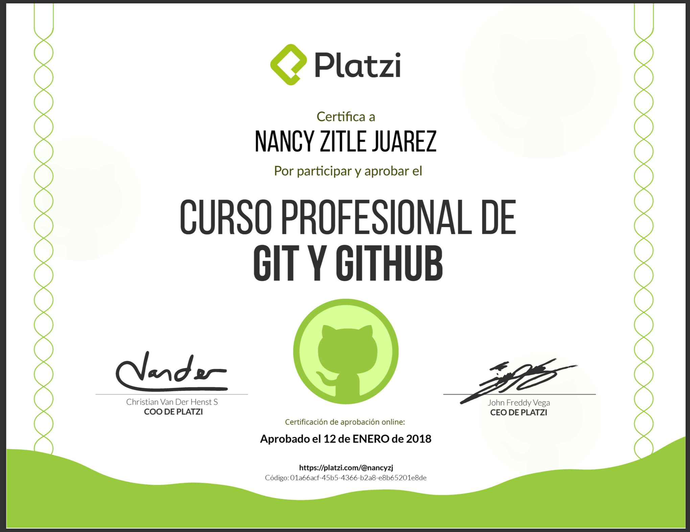

# curso-git-github
Curso profesional de git y github de platzi  
## Temario

1. ¿Qué es Git?
2. ¿Qué es GitHub?
3. ¿Qué vamos a aprender de Git y GitHub?
4. ¿Qué es un Sistema Control de Versiones?
5. Los beneficios de usar Git
6. Los tres estados de Git
7. ¿Qué es GitHub?
8. Instalación y configuración de Git
9. Instalando Git en Linux
10. Instalando Git en Windows
11. Comandos útiles de la terminal
12. git-init (Creando Repositorios)
13. git add | rm | status (Agregando, quitando y viendo el status de archivos) 
14. git commit (Confirmando cambios)
15. git tag (Etiquetando confirmaciones) 
16. git log (Revisando la historia de nuestro proyecto)
17. git diff (Revisando los cambios entre versiones)
18. git reset --soft
19. git reset --mixed
20. git reset --hard
21. [Desafio: Configurar otro editor de texto](https://platzi.com/git-github/tutoriales/configurar-tu-editor-en-git/)
22. git branch ( Múltiples variantes del repositorio)
23. git checkout (Móviendonos entre ramas y versiones)
24. Trabajando entre ramas
25. git merge(Mezclando ramas y resolviendo conflictos)
26. git rebase (Reescribe la historia de tu proyecto)
27. git stash (Guardando cambios temporalmente)
28. Cherry pick eligiendo commit selectivamente
29. Desafio

## GitHub

30. Creando una cuenta en GitHub
31. git clone / fork (Clonando repositorios remotos)
32. Añadiendo una llave ssh a GitHub
33. git remote ( Añadiendo un repositorio remoto a un local)
34. git pull/fetch (Trayendo cambios desde el repositorio remoto)
35. git push(Enviando cambios al repositorio remoto)
36. Explorando la plataforma de GitHub
37. Github Projects, el SCRUM de GitHub
38. Creando un Template para Pull Request
39. .gitignore (Ignorando archivos no deseados)
40. Pull request (Colabora a proyectos externos)
41. Issues y Milestones (Repostando y monitoreando errores eficientemente)
42. ¿Cómo funciona un Pull Request en GitHub?
43. GitHub Pages, hosting gratuito de archivos estáticos
44. Dominios personalizados en GitHub
45. GitHub Desktop, todo lo que necesitas de Git en una sola herramienta gráfica
46. Enviando invie a producción 
47. Desafío: Crea un repositorio público configurando un template de Issues y Pull Requests
48. Conclusiones del curso

# Diploma 

@Nancy Zitle Juárez 
       